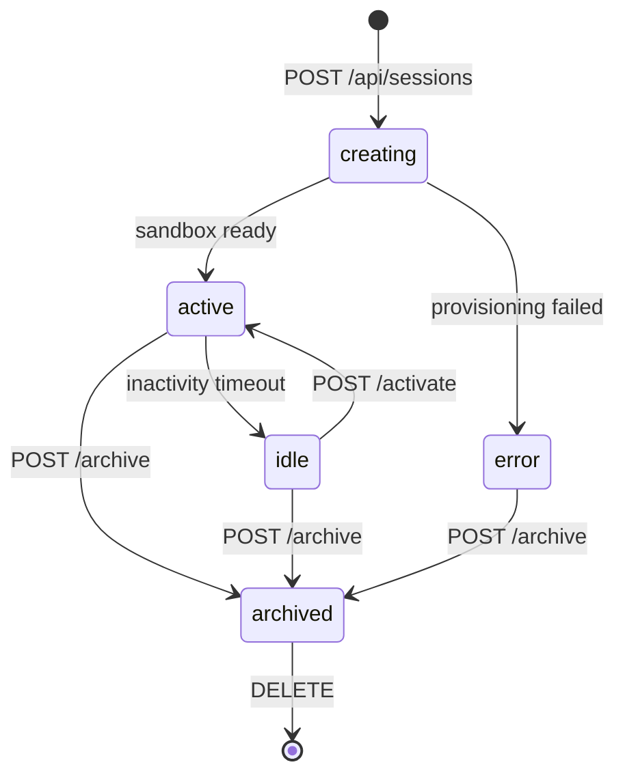
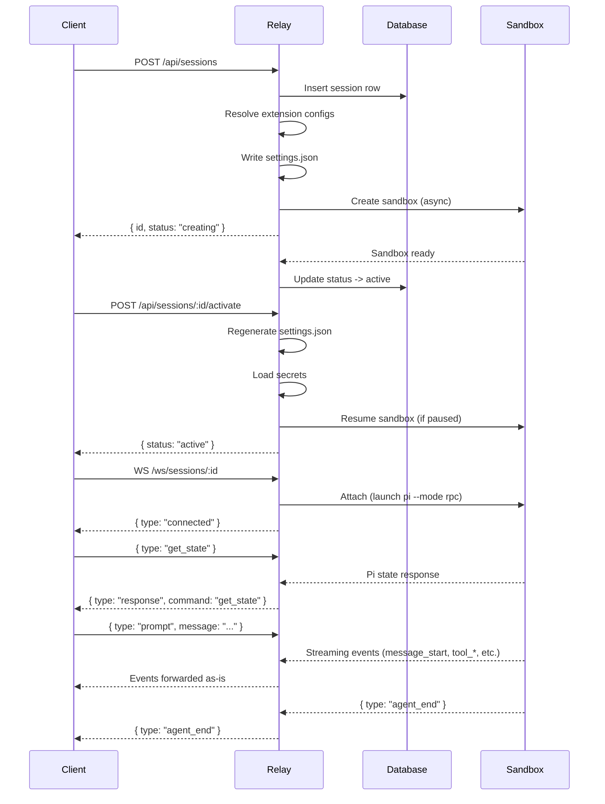
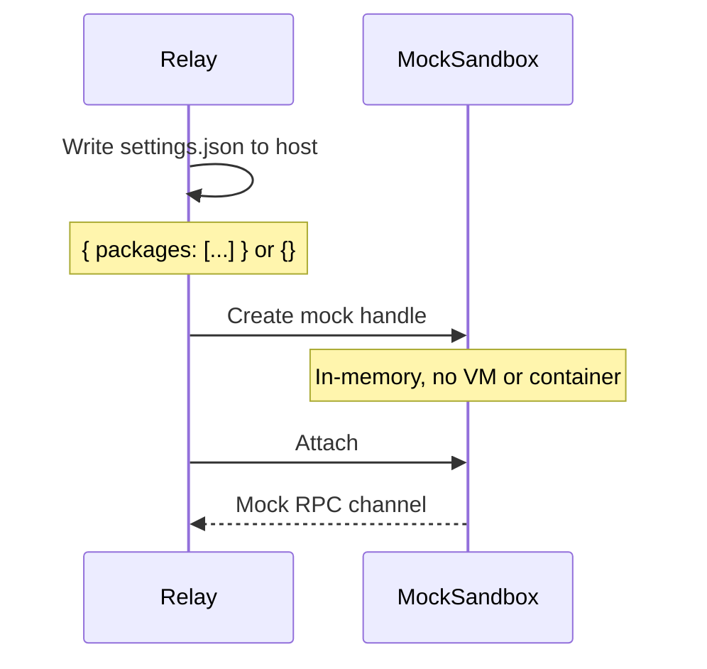
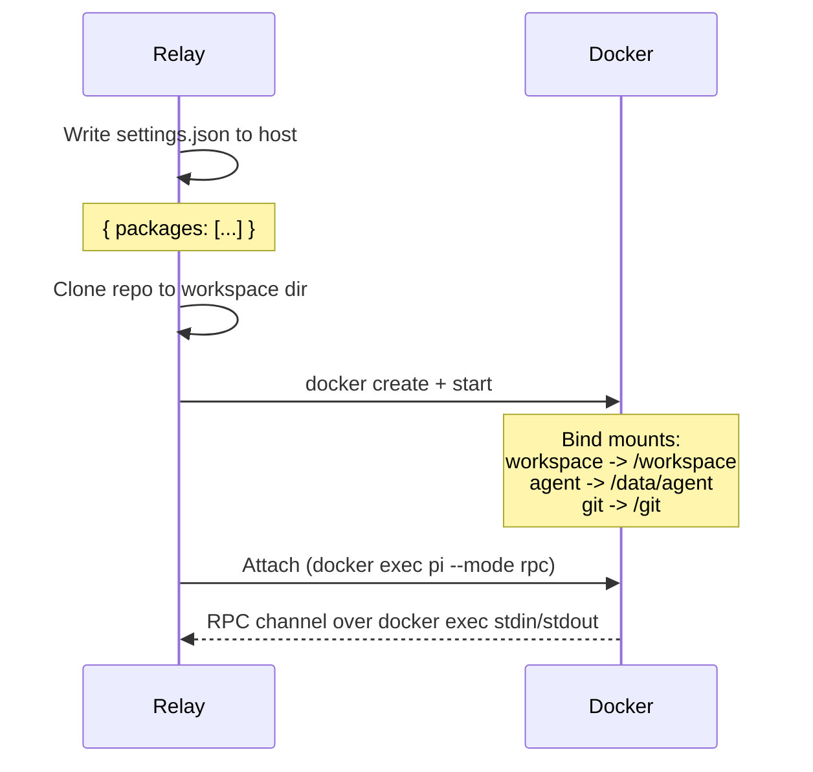
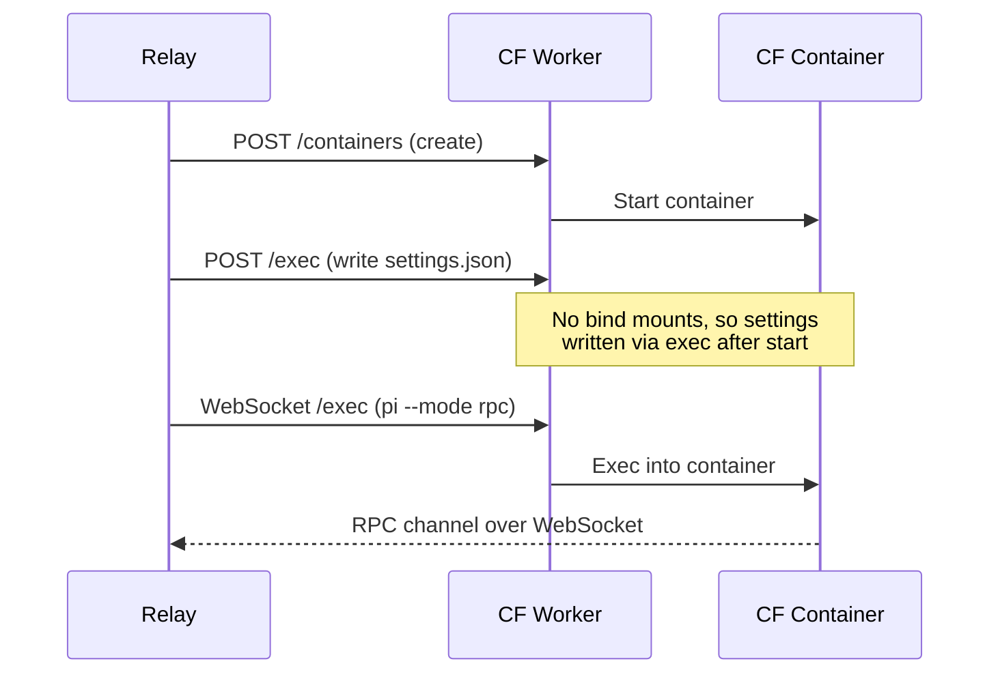
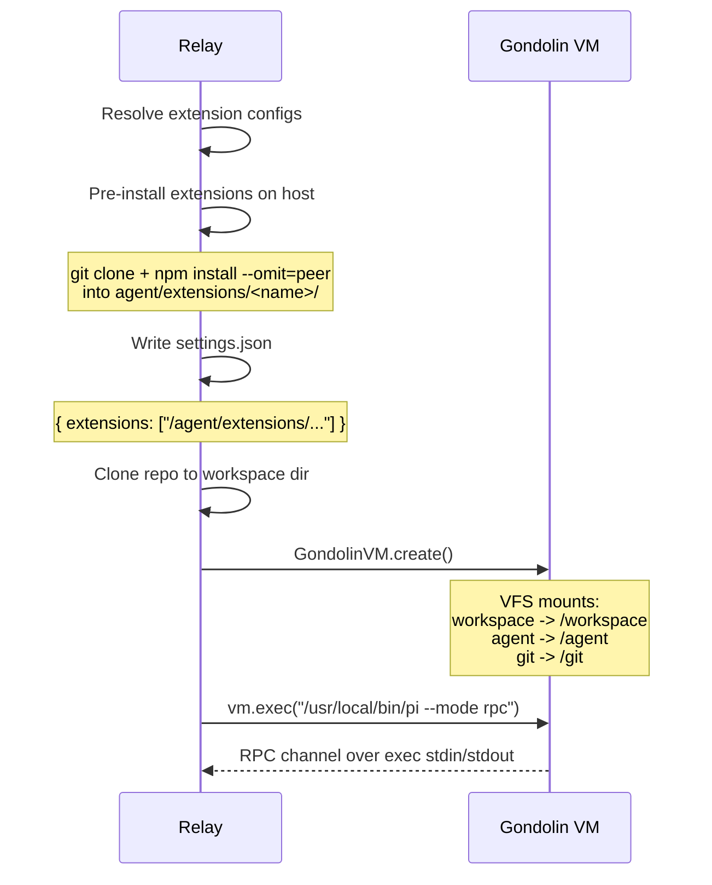

# Session Lifecycle

This document describes the order of events when creating and using a session through the relay server, with provider-specific details for each sandbox type.

## State Machine

Sessions follow this state machine:



## Common Flow

Every session follows the same high-level flow regardless of sandbox provider. The provider-specific differences are in how the sandbox is created, how files are mounted, and how extensions are installed.



## Session Creation (POST /api/sessions)

The create endpoint performs the following steps in order:

1. **Validate request** -- check required fields (mode, modelProvider, modelId).
2. **Resolve environment** -- look up the environment config if an environmentId is provided.
3. **Determine sandbox provider** -- `mock` for chat mode, otherwise from the environment config (docker, cloudflare, gondolin).
4. **Clone repo** (if code mode) -- clone the GitHub repo into the session's workspace directory on the host.
5. **Insert DB row** -- create the session record with status `creating`.
6. **Resolve extension configs** -- query the DB for global and mode-scoped extension configs, producing a list of package sources (e.g., `git:https://github.com/aliou/pi-linkup.git`).
7. **Write settings.json** -- write the pi settings file into the session's agent directory. This step is provider-specific (see below).
8. **Start sandbox provisioning** (async) -- hand off to the sandbox manager. The response returns immediately with `status: creating`.
9. **Update DB** -- once the sandbox is ready, update status to `active`.

## Session Activation (POST /api/sessions/:id/activate)

Activation prepares a session for use. It is called before opening a WebSocket connection.

1. **Check session state** -- reject if archived or in error state.
2. **Regenerate settings.json** -- re-resolve extension configs (picks up any changes since creation).
3. **Load secrets** -- decrypt all stored API keys.
4. **Resume sandbox** -- if the sandbox is paused (idle timeout), restart it. If already running, this is a no-op.
5. **Return status** -- respond with the current session status and WebSocket endpoint.

## WebSocket Connection

After activation, the client opens a WebSocket to `/ws/sessions/:id`.

1. **Create session hub** -- the relay creates (or reuses) a session hub that manages the sandbox channel and fans out events to all connected clients.
2. **Attach to sandbox** -- the hub calls `attach()` on the sandbox handle, which launches `pi --mode rpc` inside the sandbox. This creates a bidirectional RPC channel over stdin/stdout.
3. **Send connected event** -- the client receives `{ type: "connected", sessionId, lastSeq }`.
4. **Forward commands** -- the client sends JSON commands (get_state, prompt, abort, etc.) which are written to pi's stdin.
5. **Forward events** -- pi writes JSON events to stdout, which are forwarded to all connected WebSocket clients.

## Provider-Specific Details

### Mock Provider

Used for chat mode sessions (no sandbox needed). Pi runs as a simple echo/mock process.



- **Settings**: Written to `<stateDir>/sessions/<id>/agent/settings.json` on the host. Uses `packages` field (standard pi install).
- **Extensions**: Pi handles installation via `pi install` on startup.
- **Filesystem**: No bind mounts. Pi reads from the host filesystem directly.

### Docker Provider

Runs pi inside a Docker container with bind-mounted host directories.



- **Settings**: Written to `<stateDir>/sessions/<id>/agent/settings.json`. Bind-mounted into the container at `/data/agent/settings.json`. Uses `packages` field.
- **Extensions**: Pi runs `pi install` inside the container on startup. This triggers `npm install -g` for each package, which works because Docker containers have full internet access and enough resources for native compilation.
- **Filesystem**: Host directories bind-mounted at `/workspace`, `/data/agent`, and `/git`.
- **Environment**: Secrets injected as environment variables. `PI_CODING_AGENT_DIR=/data/agent`.

### Cloudflare Provider

Runs pi inside a Cloudflare Container, accessed via a Worker proxy.



- **Settings**: Written via `exec` after the container starts (no bind mounts available). Uses `packages` field.
- **Extensions**: Pi runs `pi install` inside the container.
- **Filesystem**: No host mounts. Repo cloned inside the container.

### Gondolin Provider

Runs pi inside a lightweight ARM64 microVM using the gondolin SDK. This is the only provider that pre-installs extensions on the host.



- **Settings**: Written to `<stateDir>/sessions/<id>/agent/settings.json`. Mounted into the VM at `/agent/settings.json` via gondolin's VFS. Uses `extensions` field (not `packages`).
- **Extensions**: Pre-installed on the host before the VM starts. The relay clones git repos and runs `npm install --omit=peer` in the host agent directory. Pi loads them as local directories without running `pi install`.
- **Why not `packages`**: Gondolin VMs have limited memory (default 512MB). The `pi install` path triggers `npm install -g`, which pulls the full dependency tree including native modules like `koffi`. Compiling koffi requires CMake and significant memory, often causing OOM kills. Pre-installing on the host avoids this entirely.
- **Filesystem**: Host directories mounted via gondolin's VFS (RealFSProvider) at `/workspace`, `/agent`, and `/git`.
- **Environment**: Secrets and PATH (`/usr/local/bin:/usr/bin:/bin:/usr/sbin:/sbin`) injected as environment variables. Pi binary located at `/usr/local/bin/pi`.

## Extension Installation Comparison

| Provider | Method | Settings Field | Install Location | Timing |
|----------|--------|---------------|-----------------|--------|
| Mock | `pi install` (standard) | `packages` | Host | On pi startup |
| Docker | `pi install` (in container) | `packages` | Container | On pi startup |
| Cloudflare | `pi install` (in container) | `packages` | Container | On pi startup |
| Gondolin | Pre-installed on host | `extensions` | Host (mounted into VM) | During session create/activate |

## Host Storage Layout

Each session gets a dedicated directory on the host:

```
<stateDir>/sessions/<sessionId>/
  workspace/          -> /workspace (repo clone + working files)
  agent/              -> /agent or /data/agent
    settings.json     <- pi settings (packages or extensions)
    extensions/       <- pre-installed extensions (gondolin only)
      pi-linkup/      <- cloned repo with node_modules
    sessions/         <- pi's JSONL session files
    data/
    config/
    cache/
    state/
  git/                -> /git (git config + credential helper)
```
